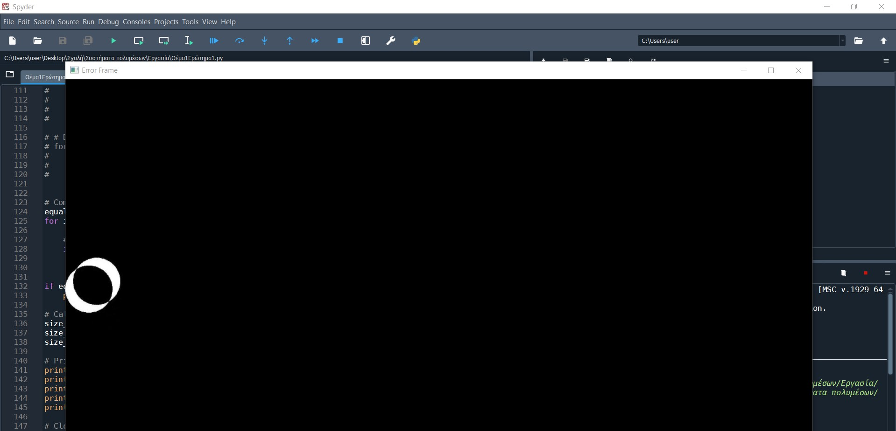
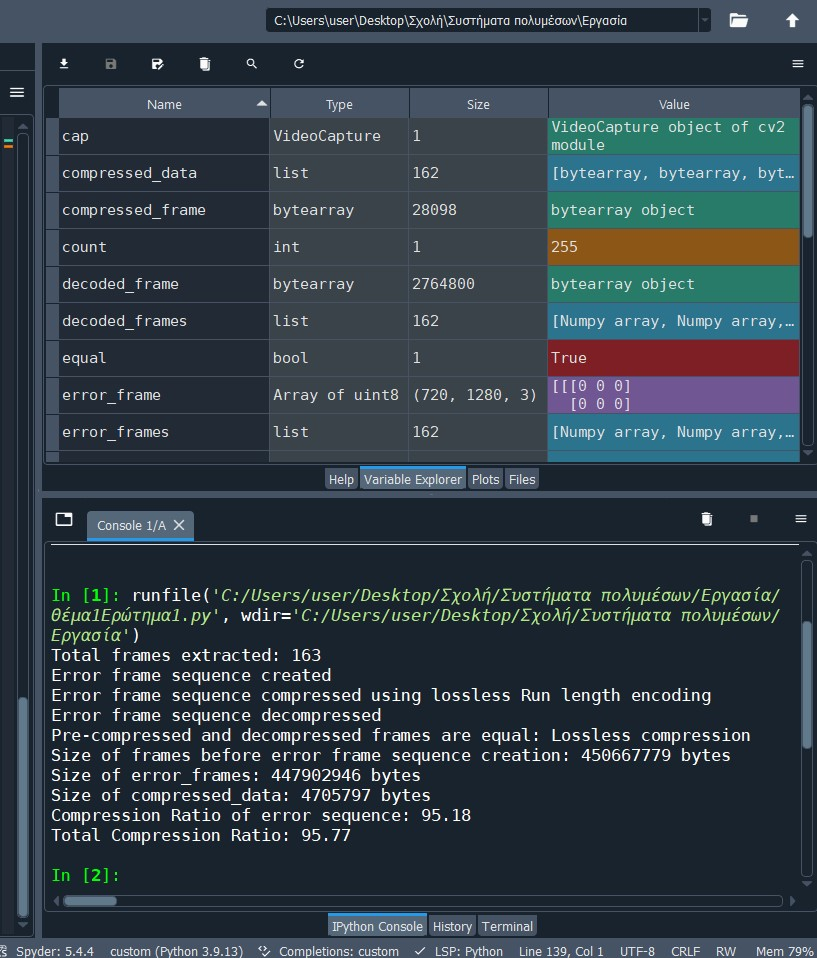
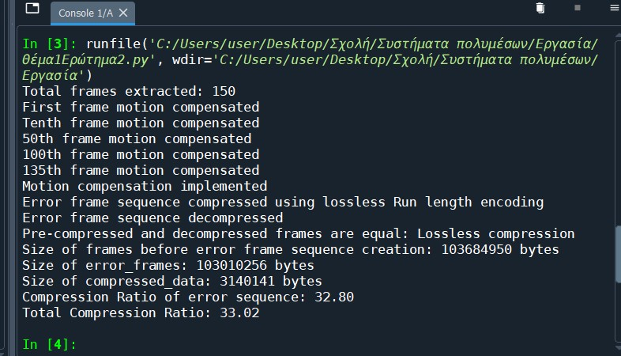
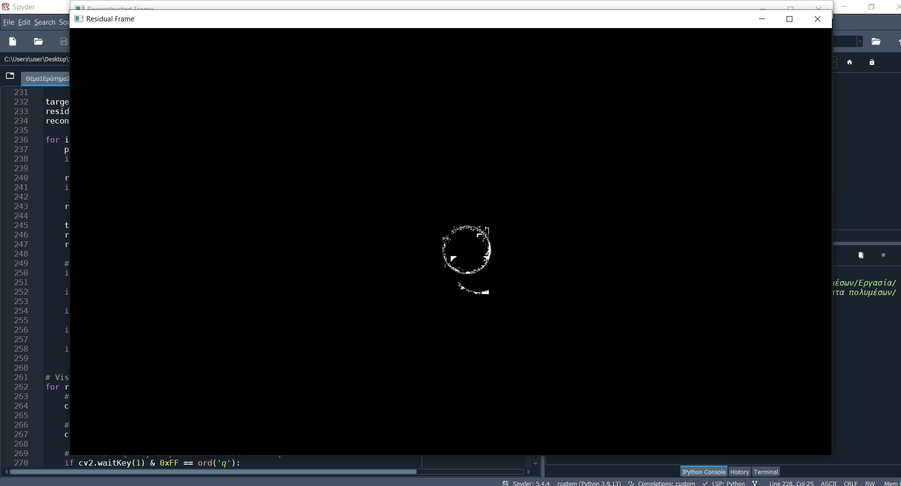
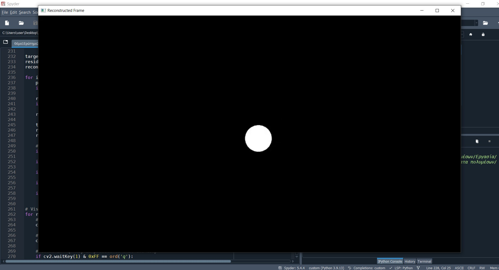

# Multimedia Systems Project

This project was developed as part of a Multimedia Systems course and demonstrates core concepts of **video processing**, including **lossless encoding**, **motion estimation and compensation**, and **object removal using motion prediction**.  
All implementations are written in **Python** using `OpenCV` and `NumPy`, focusing on algorithmic understanding rather than the use of high-level libraries.

---

## 🧩 Project Overview

The repository contains three main scripts, each addressing a different multimedia processing task:

| Script | Description |
|--------|--------------|
| `Q1part1.py` | Implements **lossless error-frame encoding** using **Run-Length Encoding (RLE)** on the difference between consecutive video frames. |
| `Q1part2.py` | Implements **motion estimation and compensation** using **macroblock-based hierarchical block matching** (64×64 blocks, search radius = 32). |
| `Q2.py` | Implements **object removal** from a short video sequence using **motion-compensated inpainting** techniques. |

Each task demonstrates a fundamental concept in digital video compression and manipulation.

---

## 🧠 Technical Summary

### 1. Lossless Error Frame Encoding (Run-Length Encoding)
- Extracts all frames from an input video (`ball.mp4`).
- Computes **error frames** (absolute difference between consecutive frames).
- Applies **Run-Length Encoding** (RLE) for lossless compression.
- Includes decompression and frame equality check to confirm that compression is **truly lossless**.
- Displays size comparison and compression ratio results.

### 2. Motion Estimation and Compensation
- Converts video frames to grayscale for computational efficiency.
- Divides each frame into **macroblocks (64×64)**.
- Performs **hierarchical motion search** using the **Mean Absolute Difference (MAD)** metric.
- Predicts P-frames from previous frames using the motion vectors.
- Reconstructs predicted frames and computes **prediction error sequences**.

### 3. Object Removal Using Motion Compensation
- Selects a target object region in the video sequence.
- Tracks motion and estimates surrounding background using **motion vectors**.
- Reconstructs the video sequence without the selected object.
- Outputs a new video stream where the target object is removed algorithmically.

---

## 🧱 Repository Structure

```
Multimedia-Systems-Project/
│
├── Q1part1.py       # Lossless error-frame encoding (RLE)
├── Q1part2.py        # Motion estimation and compensation
├── Q2.py           # Object removal using motion compensation
├── README.md               # Project documentation
```

---

## ⚙️ Requirements

To run the scripts, you need:

- Python 3.8+
- OpenCV (`cv2`)
- NumPy
- Matplotlib (optional, for visualization)

Install dependencies:
```bash
pip install opencv-python numpy matplotlib
```

---

## 🚀 Usage

Each script is self-contained and can be executed independently.

### Example (Run-Length Encoding task)
```bash
python Q1part1.py
```

### Example (Motion estimation task)
```bash
python Q1part2.py
```

### Example (Object removal task)
```bash
python Q2.py
```

By default, each script expects a local video file named `ball.mp4`.  
You can modify the filename in the script to use your own input video.

---

## 🧮 Key Algorithms

- **Run-Length Encoding (RLE):** Basic lossless compression by representing consecutive identical bytes as a single value–count pair.  
- **Block Matching Algorithm (BMA):** Motion estimation using **Mean Absolute Difference (MAD)** between candidate blocks in a defined search area.  
- **Hierarchical Motion Search:** Multi-scale search to accelerate block matching by progressively reducing search resolution.  
- **Motion Compensation & Inpainting:** Reconstructing missing or modified regions in a video sequence based on motion vectors and neighboring frame data.

---

## 📊 Results and Observations

- The RLE compression successfully achieved **lossless reconstruction** for simple video sequences with large static areas.
- Motion estimation worked effectively for moderate motion but became computationally heavy for large search radii (k=32).
- Object removal produced visually consistent results for small objects with slow motion and a static background.

---

## 🖼️ Example Outputs

| Task | Example |
|------|----------|
| **Error Frame Visualization (Q1part1)** |  |
| **Q1part1 Executed** |  |
| **Motion Estimation Console Output (Q1part2)** |  |
| **Residual Frame** |  |
| **Reconstructed Frame (after decoding)** |  |


## 🧾 Notes

- Scripts are educational implementations aimed at demonstrating fundamental multimedia techniques.  
- They can be extended with more advanced compression methods (e.g., Huffman coding, DCT-based prediction, or optical flow).

---

## 📚 Keywords
`Video Compression` • `Run-Length Encoding` • `Motion Estimation` • `Macroblocks` • `Motion Compensation` • `Computer Vision` • `Python` • `OpenCV`
